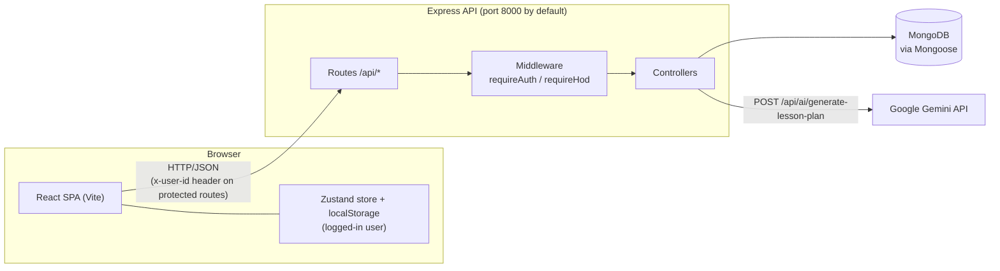

# WorkLens

**A faculty workload and academic operations platform for colleges, with separate portals for teaching/non-teaching staff and Heads of Department (HOD).**

WorkLens brings the day-to-day academic tasks of a department into one web application: course and attendance management, assignments and grading, lesson planning, study materials, online classes, timetables, leave requests, extra duties, messaging, and notifications. A dedicated HOD portal adds leave approval with substitute planning, faculty availability, workload analysis, and duty allocation.

> **Status:** Academic/portfolio project. It is a working full-stack application, but it does not yet include production-grade authentication, automated tests, or deployment configuration. See [Known Limitations](#known-limitations-and-future-improvements).

---

## Table of Contents

- [Key Features](#key-features)
- [Tech Stack](#tech-stack)
- [System Architecture](#system-architecture)
- [Project Structure](#project-structure)
- [Prerequisites](#prerequisites)
- [Installation and Setup](#installation-and-setup)
- [Environment Variables](#environment-variables)
- [Running the Application](#running-the-application)
- [Seeding Demo Data](#seeding-demo-data)
- [API Documentation](#api-documentation)
- [Database Design](#database-design)
- [Authentication and Security](#authentication-and-security)
- [Testing](#testing)
- [Deployment](#deployment)
- [Known Limitations and Future Improvements](#known-limitations-and-future-improvements)
- [Contributing](#contributing)

---

## Key Features

### Faculty portal (roles: `teaching`, `non-teaching`)

| Area | What is implemented |
|---|---|
| **Dashboard** | Summary stats, today's schedule, weekly activity chart, hours chart, recent activity, active courses, and upcoming tasks (`/api/dashboard/*`). |
| **Courses** | Create, edit, and delete courses; enroll and unenroll students; per-course analytics. |
| **Attendance** | Load a course roster, record attendance by course and date, view a student's attendance history, delete records, and export a day's attendance as CSV. |
| **Assignments** | Create and manage assignments, record submissions, grade individual submissions, bulk-save marks, and view assignment analytics. |
| **Lesson Plans** | Create, update, complete, and delete lesson plans; stats and calendar views. **AI generation** of a lesson plan through the Google Gemini API. |
| **Study Materials** | CRUD for course materials with type filtering, text search index, and stats. |
| **Online Classes** | Schedule classes (Zoom, Meet, Teams, other), update status (scheduled / live / completed / cancelled), and view stats. |
| **Timetable** | Weekly timetable derived from each course's schedule (`/api/timetable`). |
| **Leave Management** | Apply for leave, view leave history, leave balance, monthly statistics, and holidays. |
| **Extra Duties** | CRUD for extra duties such as substitution classes and invigilation. |
| **Messages** | Compose and manage messages to course audiences; mark as read; delete. |
| **Notifications** | Notification panel with unread count, mark-as-read, and mark-all-read. |
| **Activity Logs** | View, create, and clear activity log entries. |
| **Workflow Review** | Submit and list workflow feedback. |
| **Settings / Profile** | Per-user profile and notification preferences. Dark theme UI. |

### HOD portal (role: `hod`)

| Area | What is implemented |
|---|---|
| **Dashboard** | Department snapshot, action-required items, overdue tasks, pending question papers, open escalations, and upcoming deadlines. |
| **Leave Management** | Pending leaves, overview, history, CSV export, leave calendar, balances, insights, per-leave **impact** analysis, and approve-with-cover (substitute assignment). |
| **Availability and Substitutions** | Faculty availability, manual status overrides (Other Duty / Unavailable), substitution assignment and removal, timetable conflict detection and resolution. |
| **Faculty** | Department faculty list and workload analysis (overall and per faculty). |
| **Duty Allocation** | Preview eligible candidates, create duties, update assignees, and delete duties, using a weekly capacity limit and a daily hour cap. |
| **Task tracking** | Create and update HOD tasks, send reminders, review question papers, manage escalations, and manage deadlines. |

---

## Tech Stack

| Layer | Technologies |
|---|---|
| **Frontend** | React 18, Vite 5, React Router 6, Tailwind CSS 3, Zustand (state), Recharts and Chart.js with react-chartjs-2 (charts), react-datepicker, Lucide React (icons). Network calls use the browser `fetch` API; `axios` is listed as a dependency. |
| **Backend** | Node.js, Express 4 (CommonJS), CORS, dotenv |
| **Database** | MongoDB with Mongoose 8 |
| **Authentication** | Email, password, and role login with bcryptjs password hashing. See [Authentication and Security](#authentication-and-security) for how requests are identified. |
| **AI** | Google Gemini via `@google/generative-ai` (model `gemini-2.0-flash-lite`), used for lesson plan generation |
| **Real-time communication** | Not implemented (no WebSockets or server-sent events). |
| **Testing** | No test framework or tests present. |
| **Deployment** | No deployment configuration present (no Dockerfile, CI, or hosting config). |

---

## System Architecture

The frontend is a single-page React app that talks to a REST API built with Express. The API reads and writes MongoDB through Mongoose, and calls the Gemini API for lesson plan generation.



**Request flow**

1. The user signs in on the login page by choosing a role tab (Teaching Staff, Non-Teaching Staff, or HOD) and submitting email and password to `POST /api/auth/login`.
2. The returned user object is stored in the Zustand store (and in `localStorage` under `worklens_user`).
3. `App.jsx` renders `HodLayout` when `user.role === "hod"`, otherwise `FacultyLayout`.
4. Protected requests send the user's ID in an `x-user-id` header. The `requireAuth` and `requireHod` middleware look the user up in MongoDB.

---

## Project Structure

```text
WorkLens/
├── backend/
│   ├── server.js              # Express app entry point, route mounting, error handler
│   ├── config/db.js           # MongoDB connection (uses MONGO_URI)
│   ├── routes/                # Route definitions, one file per feature
│   │   └── HOD/hodRoutes.js   # All /api/hod/* routes (HOD-only)
│   ├── controller/            # Request handlers / business logic
│   │   └── HOD/               # HOD controllers (leave, workload, duty allocation)
│   ├── middleware/
│   │   ├── requireAuth.js     # Requires a valid x-user-id
│   │   └── hod/requireHod.js  # Requires a valid x-user-id with role "hod"
│   ├── models/                # Mongoose schemas
│   │   └── HOD/               # HOD-specific models
│   ├── utils/                 # logActivity and HOD helpers
│   └── scripts/               # Database seed scripts
│       └── HOD/seedHod.js
└── frontend/
    ├── index.html
    ├── vite.config.js
    ├── tailwind.config.js
    └── src/
        ├── App.jsx            # Role-based layout and routing
        ├── main.jsx
        ├── pages/             # Faculty pages
        │   └── HOD/           # HOD pages
        ├── components/        # Shared UI components
        │   └── HOD/           # HOD layout, sidebar, cards, panels
        ├── services/          # API clients (api.js, HOD/hodApi.js, HOD/dutyAllocationApi.js)
        ├── store/useAppStore.js  # Zustand store (user, notifications, courses, toast)
        ├── hooks/useData.js
        └── ThemeContext.jsx
```

---

## Prerequisites

- **Node.js** and **npm**. The repository does not pin a version; a current LTS release (18 or newer) is recommended, since Vite 5 requires Node 18+.
- **MongoDB**: a local instance or a MongoDB Atlas cluster, and its connection string.
- **Google Gemini API key** (optional): only needed for the AI lesson plan generator.

---

## Installation and Setup

The frontend and backend live in separate folders and each has its own `package.json`.

```bash
# 1. Clone the repository
git clone <your-repository-url>
cd WorkLens

# 2. Install backend dependencies
cd backend
npm install

# 3. Install frontend dependencies
cd ../frontend
npm install
```

Then create the environment files described in the next section.

---

## Environment Variables

The repository does not include `.env.example` files. Create the following manually. Both `.env` files are git-ignored.

### Backend: `backend/.env`

```env
# Required
MONGO_URI=mongodb://127.0.0.1:27017/worklens

# Optional
PORT=8000
GEMINI_API_KEY=your_gemini_api_key_here

# Optional tuning for HOD workload / duty allocation (defaults shown)
DUTY_WEEKLY_CAPACITY_HOURS=40
DUTY_MAX_HOURS_PER_DAY=10
TEACHING_NORM_HOURS=16
```

| Variable | Required | Default | Used for |
|---|---|---|---|
| `MONGO_URI` | Yes | none | MongoDB connection string (server and seed scripts). |
| `PORT` | No | `8000` | Port the API listens on. |
| `GEMINI_API_KEY` | Only for AI | none | Lesson plan generation. Without it, `/api/ai/generate-lesson-plan` returns an error asking you to set it. |
| `DUTY_WEEKLY_CAPACITY_HOURS` | No | `40` | Weekly capacity used in duty allocation. |
| `DUTY_MAX_HOURS_PER_DAY` | No | `10` | Daily hour cap used in duty allocation. |
| `TEACHING_NORM_HOURS` | No | `16` | Teaching-hours norm used in HOD workload analysis. |

### Frontend: `frontend/.env`

```env
VITE_API_URL=http://localhost:8000
```

| Variable | Required | Notes |
|---|---|---|
| `VITE_API_URL` | **Yes, in practice** | Base URL of the backend. Several files fall back to `http://localhost:8000`, but others (login page, settings page, dashboard charts, workflow page) read `VITE_API_URL` with no fallback, so **login fails if it is unset**. |

> Vite only reads `.env` files at startup. Restart `npm run dev` after changing them.

---

## Running the Application

Use two terminals.

**Terminal 1: backend**

```bash
cd backend
npm run dev      # development, auto-restarts with nodemon
# or
npm start        # plain node server.js
```

You should see `MongoDB connected successfully!` and `Server on http://localhost:8000`. Opening `http://localhost:8000/` returns a small JSON status message.

**Terminal 2: frontend**

```bash
cd frontend
npm run dev      # Vite dev server (default http://localhost:5173)
```

**Production build of the frontend**

```bash
cd frontend
npm run build    # outputs to frontend/dist
npm run preview  # serves the built files locally
```

The backend has no separate build step.

---

## Seeding Demo Data

There are no users until you seed them, so you cannot log in on a fresh database. From the `backend` folder:

```bash
npm run seed:users          # creates two demo users
npm run seed                # seeds courses (5 courses x 20 students) and extra duties
npm run seed:leaves         # seeds leave balance, leaves, and holidays
npm run seed:notifications  # sample notifications for every existing user
npm run seed:all            # runs the four scripts above in order
```

The HOD demo data has its own script that is **not** wired into `package.json`, and it expects `teaching@gmail.com` to exist, so run `seed:users` first:

```bash
node scripts/HOD/seedHod.js
```

> `seed`, `seed:leaves`, and `seed:notifications` **delete existing documents** in their collections before inserting. Do not run them against a database that holds data you want to keep.

**Demo accounts created by the seed scripts** (local development only):

| Role tab on login page | Email | Password | Created by |
|---|---|---|---|
| Teaching Staff | `teaching@gmail.com` | `123456` | `seed:users` |
| Non-Teaching Staff | `staff@gmail.com` | `123456` | `seed:users` |
| HOD | `hod@gmail.com` | `123456` | `scripts/HOD/seedHod.js` |

`seedHod.js` also creates six additional teaching users in the Computer Science department, plus demo leaves, tasks, papers, escalations, substitutions, and deadlines.

---

## API Documentation

Base URL: `http://localhost:8000`. All routes are mounted under `/api/...`. Request and response bodies are JSON.

**Auth legend:** *None* = no check is performed. *User* = `requireAuth` (requires a valid `x-user-id` header). *HOD* = `requireHod` (valid `x-user-id` for a user whose role is `hod`).

### Auth

| Method | Endpoint | Auth | Description |
|---|---|---|---|
| POST | `/api/auth/login` | None | Log in with `email`, `password`, and `role`. |

Request:

```json
{ "email": "teaching@gmail.com", "password": "123456", "role": "Teaching Staff" }
```

`role` accepts `"Teaching Staff"`, `"Non-Teaching Staff"`, or `"HOD"` (mapped to `teaching`, `non-teaching`, `hod`).

Success response (`200`):

```json
{
  "message": "Login successful",
  "user": {
    "_id": "…",
    "name": "Dr. Sarah Chen",
    "email": "teaching@gmail.com",
    "role": "teaching",
    "department": "Computer Science",
    "phone": "…",
    "bio": "…",
    "memberSince": "Jan 2026"
  }
}
```

Errors: `400` `{ "message": "All fields are required" }` or `{ "message": "Invalid credentials" }`; `500` `{ "message": "Server error" }`. No token is returned.

### Protected requests

```http
GET /api/leaves
x-user-id: <user _id returned by login>
```

### Faculty endpoints

| Resource | Endpoints | Auth |
|---|---|---|
| **Dashboard** | `GET /api/dashboard/stats`, `/today`, `/weekly-activity`, `/hours`, `/recent-activity`, `/courses`, `/upcoming-tasks` | None |
| **Courses** | `GET/POST /api/courses`; `GET/PUT/DELETE /api/courses/:id`; `GET /api/courses/:id/students`, `/enrolled-students`, `/analytics`; `POST /api/courses/:id/enroll`; `DELETE /api/courses/:id/enroll/:studentId` | None |
| **Attendance** | `GET/POST /api/attendance`; `GET /api/attendance/roster/:courseId`; `GET /api/attendance/student/:studentId`; `GET /api/attendance/:courseId/:date`; `GET /api/attendance/:courseId/:date/export` (CSV); `DELETE /api/attendance/:id` | None |
| **Assignments** | `GET/POST /api/assignments`; `GET /api/assignments/analytics`; `GET /api/assignments/course/:courseId`; `GET/PUT/DELETE /api/assignments/:id`; `POST /api/assignments/:id/submit`; `PUT /api/assignments/:id/grade/:submissionId`; `GET /api/assignments/:id/students-marks`; `PUT /api/assignments/:id/bulk-marks` | None |
| **Lesson plans** | `GET/POST /api/lesson-plans`; `GET /api/lesson-plans/stats`, `/calendar`; `GET/PUT/DELETE /api/lesson-plans/:id`; `PATCH /api/lesson-plans/:id/complete` | None |
| **AI** | `POST /api/ai/generate-lesson-plan` (body: `courseId`, `planType`, `durationWeeks`, `topics`, `extraInstructions`) | None |
| **Study materials** | `GET/POST /api/study-materials`; `GET /api/study-materials/stats`; `GET/PUT/DELETE /api/study-materials/:id` | None |
| **Online classes** | `GET/POST /api/online-classes`; `GET /api/online-classes/stats`; `GET/PUT/DELETE /api/online-classes/:id`; `PATCH /api/online-classes/:id/status` | None |
| **Syllabus** | `GET/POST /api/syllabus`; `GET/PUT/DELETE /api/syllabus/:courseId`; `PATCH /api/syllabus/:courseId/topic` | None |
| **Timetable** | `GET /api/timetable` | None |
| **Extra duties** | `GET/POST /api/duties`; `GET/PUT/DELETE /api/duties/:id` | None |
| **Notifications** | `GET/POST /api/notifications`; `PATCH /api/notifications/read-all`; `PATCH /api/notifications/:id/read`; `DELETE /api/notifications/:id` | None |
| **Activity logs** | `GET/POST/DELETE /api/activity-logs`; `DELETE /api/activity-logs/:id` | None |
| **Workflow feedback** | `GET/POST /api/workflow/feedback` | None |
| **Settings** | `GET/PUT /api/settings/:userId` | None |
| **Messages** | `GET/POST /api/messages`; `POST /api/messages/receive`; `PATCH /api/messages/read-all`; `PATCH /api/messages/:id/read`; `DELETE /api/messages/:id` | User |
| **Leaves** | `GET/POST /api/leaves`; `GET /api/leaves/balance`; `GET /api/leaves/monthly`; `DELETE /api/leaves/:id` | User |
| | `PATCH /api/leaves/:id/status` | HOD |
| | `GET /api/leaves/holidays` | None |

> The syllabus API exists on the backend, but its page is commented out in `frontend/src/App.jsx`, so it is not reachable from the UI.

### HOD endpoints (all require HOD)

`router.use(requireHod)` is applied to every route under `/api/hod`.

| Area | Endpoints |
|---|---|
| Dashboard | `GET /api/hod/dashboard` |
| Leaves | `GET /api/hod/leaves/pending`, `/overview`, `/history`, `/export`, `/calendar`, `/balances`, `/insights`; `GET /api/hod/leaves/:id/impact`; `POST /api/hod/leaves/:id/approve-with-cover`; `PATCH /api/hod/leaves/:id` |
| Availability | `GET /api/hod/availability`; `POST /api/hod/availability/status` |
| Substitutions | `GET/POST /api/hod/substitutions`; `DELETE /api/hod/substitutions/:id` |
| Conflicts | `GET /api/hod/conflicts`; `PATCH /api/hod/conflicts/resolve` |
| Faculty | `GET /api/hod/faculty`, `/faculty/workload`, `/faculty/:id/workload` |
| Tasks | `GET /api/hod/tasks/overdue`; `POST /api/hod/tasks`; `PATCH /api/hod/tasks/:id`; `POST /api/hod/tasks/:id/remind` |
| Question papers | `GET /api/hod/papers/pending`; `PATCH /api/hod/papers/:id/review` |
| Escalations | `GET /api/hod/escalations/open`; `PATCH /api/hod/escalations/:id/resolve` |
| Deadlines | `GET/POST /api/hod/deadlines`; `PATCH /api/hod/deadlines/:id/complete`; `DELETE /api/hod/deadlines/:id` |
| Duty allocation | `POST /api/hod/duty-allocation/candidates`; `GET/POST /api/hod/duty-allocation`; `PUT /api/hod/duty-allocation/:id/assignees`; `DELETE /api/hod/duty-allocation/:id` |

Detailed request and response schemas for these endpoints are not documented here; see the controllers in `backend/controller/` for exact payloads.

---

## Database Design

MongoDB, accessed with Mongoose. The connection is made in `backend/config/db.js` from `MONGO_URI`.

### Core collections

| Model | Purpose and notable fields | Indexes / constraints |
|---|---|---|
| `User` | `name`, `email`, `password` (bcrypt hash), `role` (`teaching`, `non-teaching`, `admin`, `hod`), `department`, `phone`, `bio`, notification preferences | `email` unique |
| `Course` | `courseId`, course details, schedule, embedded students, `teacher`, `batches` | `courseId` unique; indexes on `status`, `teacher.id`, `batches.teacher.id` |
| `Attendance` | Attendance records per course and date | none declared |
| `Assignment` | Assignment details, type (`ASSIGNMENT`, `PROJECT`, `CODING`, `QUIZ`, `EXAM`), submissions (`submitted` / `graded` / `late`), refs `Course` | indexes on `courseId`, `deadline`, `completed` |
| `LessonPlan` | Plan status (`pending` / `in-progress` / `completed`), refs `Course` and `User` | indexes on `faculty.id`, `courseId` |
| `StudyMaterial` | Material type (notes, ppt, pdf, lab_manual, question_bank, previous_paper, video_link, other) | indexes on `courseId`, `type`, `teacher.id`, plus a text index on `title` and `description` |
| `OnlineClass` | Platform, status, schedule; refs `Course` and `User` | indexes on `courseId + scheduledAt`, `teacherId + scheduledAt`, `status` |
| `Syllabus` | One syllabus per course; refs `Course` | `courseId` unique |
| `Leave`, `LeaveBalance`, `Holiday` | Leave type (`Sick`, `Casual`, `Earned`), status (`Pending`, `Approved`, `Rejected`), balances, holidays | defined in `models/Leave.js` |
| `Message` | Sender, direction, audience, category, priority; refs `User` | index on `senderId + direction + createdAt` |
| `Notification` | `type`, `read`; refs `User` | index on `userId + read + createdAt` |
| `ExtraDuty`, `ActivityLog`, `Faculty` | Extra duties, activity log entries, faculty profile info | none declared |

### HOD collections

| Model | Purpose | Indexes / constraints |
|---|---|---|
| `HodTask`, `QuestionPaper`, `Escalation`, `Deadline` | HOD task tracking, paper review, escalations, deadlines | in `models/HOD/HodModels.js` |
| `Substitution` | Substitute assignment for a leave, course, and day | unique on `leaveId + courseId + dateKey` |
| `FacultyStatus` | Manual availability status (`Other Duty` / `Unavailable`) | unique on `facultyId + dateKey` |
| `DutyAllocation` | Duties with assignees | indexes on `department + dateKey`, `assignees.facultyId + dateKey` |

Relationships are reference-based (`ObjectId` with `ref`) between `Course`, `User`, `Assignment`, `LessonPlan`, `StudyMaterial`, and `OnlineClass`. Some HOD collections reference faculty by ID string rather than `ObjectId`.

---

## Authentication and Security

**Implemented**

- Passwords are hashed with **bcryptjs** (cost factor 10 in the seed scripts) and compared with `bcrypt.compare` at login. The password hash is excluded from the user objects attached by the middleware.
- Role-based access on the HOD API: every `/api/hod/*` route and `PATCH /api/leaves/:id/status` require a user whose role is `hod`.
- The Gemini API key is read from the environment and is not committed (`.env` is git-ignored).
- The frontend renders the HOD or faculty layout based on the stored user's role.

**Important caveats (not implemented)**

- **No JWTs or sessions.** The server issues no token. Protected routes trust the client-supplied `x-user-id` header, so anyone who knows a valid user ID can call those routes as that user. This is **not suitable for production**.
- Most faculty routes (courses, attendance, assignments, dashboard, notifications, settings, and others) have **no authentication middleware**.
- CORS is open to all origins (`app.use(cors())`).
- No rate limiting, input validation library, or security headers (such as Helmet) are configured.
- Request body limit is 50 MB.
- The logged-in user is stored in the browser's `localStorage` (`worklens_user`).

---

## Testing

There is no automated test setup. Neither `package.json` defines a `test` script, and the repository contains no test files or test frameworks.

Manual verification workflow:

1. Seed demo data (see [Seeding Demo Data](#seeding-demo-data)).
2. Start both servers and sign in with each of the three demo roles.
3. Visit `http://localhost:8000/` to confirm the API is running.

---

## Deployment

The repository does not include any deployment configuration (no Dockerfile, CI workflow, `Procfile`, or hosting config), so no verified deployment steps are provided.

General notes derived from the code:

- The frontend builds to static files with `npm run build` (output in `frontend/dist`).
- Set `VITE_API_URL` to the public backend URL **before** building, since Vite inlines it at build time.
- The backend needs `MONGO_URI` (and optionally `GEMINI_API_KEY`) set in its environment and is started with `npm start`.
- Review [Authentication and Security](#authentication-and-security) before any public deployment.

---

## Known Limitations and Future Improvements

### Existing limitations

- Authentication relies on an `x-user-id` header rather than tokens or sessions, and most routes are unauthenticated.
- No automated tests, CI, `.env.example` files, license, or deployment configuration.
- Students are stored as embedded data inside courses. There is no student login or student portal; the app serves staff and HODs only.
- The Syllabus page is commented out in the frontend router, and `/performance` renders a "Coming Soon" placeholder.
- `/lesson-plans` and `/online-classes` are each declared twice in `App.jsx`, with a "Coming Soon" placeholder after the real route. React Router uses the first match, so the real pages load, but the duplicates should be cleaned up.
- `seedLeaves.js` seeds leave balance data under a placeholder faculty ID (`faculty_001`), which does not correspond to a seeded user.
- The `admin` role exists in the `User` schema, but there is no admin portal or login tab for it.
- Real-time features (live notifications, chat) are not implemented; data is fetched over HTTP.

### Proposed enhancements

- Replace `x-user-id` with JWT or session-based authentication and apply it to all protected routes.
- Add request validation, rate limiting, security headers, and a restricted CORS policy.
- Add unit and integration tests (for example Jest and Supertest for the API, Vitest for the UI).
- Add `.env.example` files, a Dockerfile or `docker-compose.yml` for local setup, and a CI pipeline.
- Re-enable and complete the Syllabus and Performance Analytics pages.
- Add real-time notifications.

---

## Contributing

1. Fork the repository and create a feature branch: `git checkout -b feature/your-feature`.
2. Follow the existing code style and folder conventions (routes, controllers, models on the backend; pages, components, services on the frontend).
3. Test your change manually with seeded data and make sure both servers start without errors.
4. Commit with a clear message and push your branch.
5. Open a pull request describing what changed and why.

---
